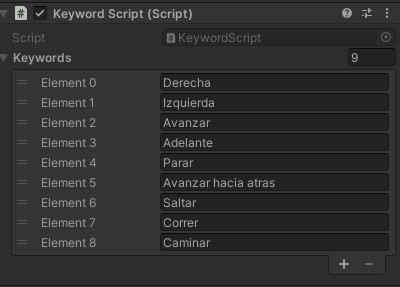

# Práctica 5 de Interfaces Inteligentes. Reconocimiento de Voz

## **Autor**: Francisco Jesús Mendes Gómez.

## **Índice:**  

1. [**Ejecución**](#id1)
2. [**Scripts e Implementación**](#id2)   

<div name="id1" />

## 1. Ejecución


Podemos ver dos botones uno para activar el dictado y otro para activar las keywords. Nota: Ambas no pueden estar activas al mismo tiempo.

+ Si tenemos las keywords activas podemos usar los siguientes comandos para mover el personaje:  
  
Derecha, Izquierda, Avanzar, Adelante, Parar, Avanzar hacia atras, Saltar, Correr y Caminar.  
  
  

+ Si tenemos activado el dictado podremos observar como por pantalla a modo de subtítulos se escribe lo que estamos diciendo.


<div name="id2" />

## 2. Scripts e Implementación

Los scripts `FollowPlayer.cs` y `GameController.cs` han sido descritas en prácticas anteriores y siguen funcionado de la misma manera.

Para esta práctica los scripts nuevos implementados son los siguientes:

1. Keyword Recognizer

El código desarrollado para este apartado es el siguiente:
`KeywordScript.cs`
```c#
using System;
using System.Text;
using UnityEngine;
using UnityEngine.Windows.Speech;
#if ENABLE_INPUT_SYSTEM && STARTER_ASSETS_PACKAGES_CHECKED
using UnityEngine.InputSystem;
using StarterAssets;
#endif

public class KeywordScript : MonoBehaviour
{

    private GameObject player;
    private StarterAssetsInputs _input;


    private bool isActivated_ = false;
    private bool buttonPressed_ = false;

    [SerializeField]
    private string[] m_Keywords;

    private KeywordRecognizer m_Recognizer;

    void Start()
    {
        player = GameObject.Find("Player");
        _input = player.GetComponent<StarterAssetsInputs>();
        m_Keywords = new string[] {"Derecha", "Izquierda", "Avanzar", "Adelante", "Parar", "Avanzar hacia atras", "Saltar", "Correr", "Caminar"};
        m_Recognizer = new KeywordRecognizer(m_Keywords);
        m_Recognizer.OnPhraseRecognized += OnPhraseRecognized;
    }

    private void OnPhraseRecognized(PhraseRecognizedEventArgs args)
    {
        StringBuilder builder = new StringBuilder();
        builder.AppendFormat("{0} ({1}){2}", args.text, args.confidence, Environment.NewLine);
        builder.AppendFormat("\tTimestamp: {0}{1}", args.phraseStartTime, Environment.NewLine);
        builder.AppendFormat("\tDuration: {0} seconds{1}", args.phraseDuration.TotalSeconds, Environment.NewLine);
        Debug.Log(builder.ToString());
        ExecuteAction(args.text);
    }

    void Update()
    {
        if (buttonPressed_)
        {
            StartStopKeywords();
            buttonPressed_ = false;
        }
    }

    private void OnDestroy()
    {
        m_Recognizer.Dispose();
    }

    public void pressButton()
    {
        buttonPressed_ = true;
    }

    private void StartStopKeywords ()
    {
        if(isActivated_)
        {
            PhraseRecognitionSystem.Shutdown();
            Debug.Log(PhraseRecognitionSystem.Status);
            m_Recognizer.Stop();
            isActivated_ = false;
            Debug.Log("Stop Keyword");
        }
        else
        {
            PhraseRecognitionSystem.Restart();
            Debug.Log(PhraseRecognitionSystem.Status);
            m_Recognizer.Start();
            isActivated_ = true;
            Debug.Log("Start Keywords");
        }
    }

    private void ExecuteAction(string keyword)
    {
        switch (keyword)
        {
            case "Derecha":
            {
                Debug.Log(keyword);
                _input.move = Vector2.right;
            }
            break;
            case "Izquierda":
            {
                Debug.Log(keyword);
                _input.move = Vector2.left;
            }
            break;
            case "Avanzar":
            {
                Debug.Log(keyword);
                _input.move = Vector2.up;
            }
            break;
            case "Parar":
            {
                Debug.Log(keyword);
                _input.move = Vector2.zero;
            }
            break;
            case "Avanzar hacia atras":
            {
                Debug.Log(keyword);
                _input.move = Vector2.down;
            }
            break;
            case "Saltar":
            {
                Debug.Log(keyword);
                _input.jump = true;
            }
            break;
            case "Correr":
            {
                Debug.Log(keyword);
                _input.sprint = true;
            }
            break;
            case "Caminar":
            {
                Debug.Log(keyword);
                _input.sprint = false;
            }
            break;
            default:
            break;
        }
    }
}
```
En el podemos observar las palabras que hemos escogido para que sean reconocidas:
Derecha, Izquierda, Avanzar, Adelante, Parar, Avanzar hacia atras, Saltar, Correr y Caminar. Las cuales usamos para poder hacer mover el personaje.  
  
Podemos observar la función `private void ExecuteAction(string keyword)` que recibe el input recibido por el objeto `KeywordRecognizer m_Recognizer` y es llamada por la función `OnPhraseRecognized(PhraseRecognizedEventArgs args)` la cual muestra en la consola detalles de la palabra reconocida aparte de llamar a `ExecuteAction` y con la ayuda de la interfaz que nos provee el *Starter assets* podemos mover el personaje y usar sus animaciones.  

Este script tambien posee las funciones para detener y reanudar el uso del KeywordRecognizer a través de pulsar el botón asignado para ello.  
  
2. Dictation Recognizer

En este apartado tenemos el script `DictationScript.cs`:
```c#
using UnityEditor;
using UnityEngine;
using UnityEngine.UI;
using UnityEngine.Windows.Speech;

public class DictationScript : MonoBehaviour
{
    private bool isActivated_ = false;
    private bool buttonPressed_ = false;
    private GameObject uiSpace;
    private Text Subtitulos;
    [SerializeField]
    public Text m_Hypotheses;

    //[SerializeField]
    //public Text m_Recognitions;

    private DictationRecognizer m_DictationRecognizer;

    void Start()
    {
        uiSpace = GameObject.Find("Subtitulos");
        Subtitulos = uiSpace.GetComponent<Text>();
        Subtitulos.text = "";
        m_DictationRecognizer = new DictationRecognizer();
        m_DictationRecognizer.DictationResult += Result;
        m_DictationRecognizer.DictationHypothesis += Hypothesis;
        m_DictationRecognizer.DictationComplete += DictComplete;
        m_DictationRecognizer.DictationError += DictError;
    }

    void Update()
    {
        if (buttonPressed_)
        {
            if(isActivated_)
            {
                m_DictationRecognizer.Stop();
                isActivated_ = false;
                Debug.Log("Stop Dictation");
                // PhraseRecognitionSystem.Restart();
                // Debug.Log(PhraseRecognitionSystem.Status);
            }
            else
            {
                // PhraseRecognitionSystem.Shutdown();
                // Debug.Log(PhraseRecognitionSystem.Status);
                m_DictationRecognizer.Start();
                isActivated_ = true;
                Debug.Log("Start Dictation");
            }
            buttonPressed_ = false;
        }
        if(isActivated_)
        {   
            if (Subtitulos.text.Length >= 100)
            {
                Subtitulos.text = "";
            }
        }
        
    }

    void OnDestroy()
    {
        m_DictationRecognizer.Dispose();
    }

    void Result(string text, UnityEngine.Windows.Speech.ConfidenceLevel confidence)
    {
        //m_Recognitions.text += text + " ";
        Debug.LogFormat("Dictation result: {0}; confidence = {1}", text, confidence);
    }

    void Hypothesis(string text)
    {
        Debug.LogFormat("Dictation hypothesis: {0}", text);
        Subtitulos.text = "";
        m_Hypotheses.text += text;
    }

    void DictComplete(UnityEngine.Windows.Speech.DictationCompletionCause completionCause)
    {
        if (completionCause != DictationCompletionCause.Complete)
                Debug.LogErrorFormat("Dictation completed unsuccessfully: {0}.", completionCause);
    }

    void DictError (string error, int hresult)
    {
        Debug.LogErrorFormat("Dictation error: {0}; HResult = {1}.", error, hresult);
    }

    public void pressButton()
    {
        buttonPressed_ = true;
    }
}
```

Para el cual hemos definido todas las funciones requeridas para el funcionamiento del objeto `DictationRecognizer` y el cual esta vinculado a un objeto llamado *Subtitulos* de la UI donde se imprime en pantalla a modo de subtítulos el texto transcrito del sonido captado por el micrófono.

Nota: Se ha usado la función `Hypothesis()` para que sea la que escribe en los subtitulos ya que `Result()` era un poco más lenta ya que tiene que esperar a terminar el reconocimiento, en cambio `Hypothesis()` no tiene que esperar ya que son las palabras que cree que son y en caso de corregirla, lo hace al momento.